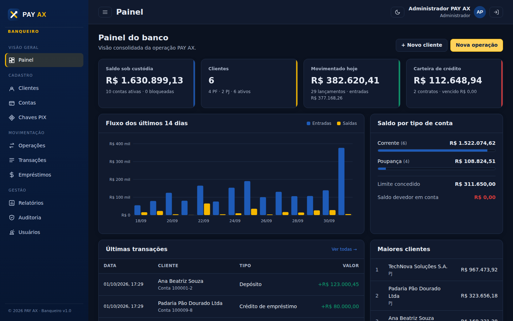
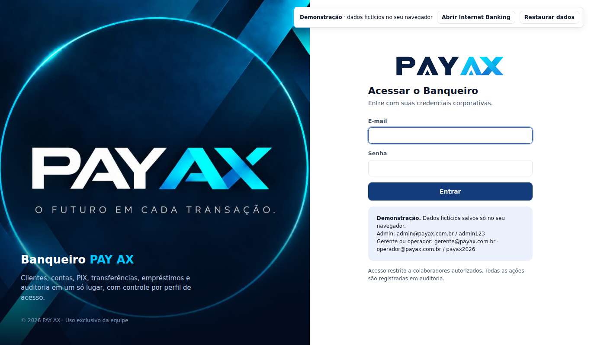
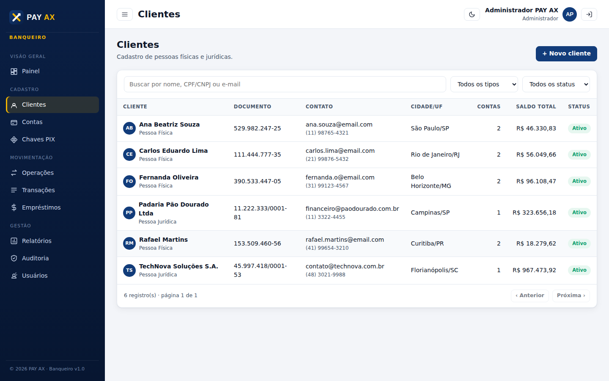
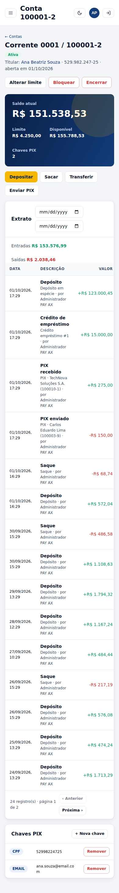

<p align="center"></p>

# Banqueiro · PAY AX

Sistema de gestão bancária da **PAY AX**: administração de clientes, contas, operações de caixa,
transferências, PIX, empréstimos, usuários, relatórios e trilha de auditoria — com a identidade visual PAY AX.



## Funcionalidades

| Módulo | O que faz |
|---|---|
| **Painel** | Saldo sob custódia, clientes, movimentação do dia, carteira de crédito, fluxo de 14 dias, saldo por tipo de conta, últimas transações e maiores clientes. |
| **Clientes** | Cadastro PF/PJ com validação de CPF/CNPJ, contato, endereço, renda/faturamento, status (ativo, inativo, bloqueado) e ficha com contas e empréstimos. |
| **Contas** | Abertura de conta corrente, poupança, pagamento ou salário com número sequencial e dígito verificador (módulo 11); limite de cheque especial; bloqueio, desbloqueio e encerramento; extrato com filtro por período. |
| **Operações** | Depósito, saque, transferência entre contas e PIX por chave, sempre em transação atômica e respeitando saldo + limite. |
| **Chaves PIX** | CPF, CNPJ, e-mail, telefone ou chave aleatória (até 5 por conta). |
| **Transações** | Consulta geral de lançamentos com filtros e **estorno** (reverte origem e destino). |
| **Empréstimos** | Simulação e contratação pela Tabela Price, crédito automático em conta, cronograma de parcelas e pagamento em ordem com débito em conta; quitação automática. |
| **Bradesco** | Conta PJ única da PAY AX no Bradesco: cobrança PIX com QR Code creditando a conta do cliente, webhook de confirmação, PIX para outros bancos, PIX sem identificação com vínculo manual e conciliação do saldo do banco com o saldo dos clientes. |
| **Internet Banking** | Portal do cliente em `/ib/` (celular e desktop): saldo, extrato com comprovantes, PIX (enviar, receber por QR Code, minhas chaves), transferências, pagamento de boletos e contas de consumo, e empréstimos. |
| **Relatórios** | Exportação CSV (compatível com Excel) de clientes, contas, transações por período e carteira de crédito. |
| **Auditoria** | Registro de todas as ações (login, cadastros, operações, estornos, alterações de limite/status) com usuário, data e IP. |
| **Usuários** | Gestão de colaboradores e perfis de acesso. |

### Perfis de acesso

| Perfil | Permissões |
|---|---|
| **Administrador** | Tudo, incluindo usuários e exclusão de clientes sem contas. |
| **Gerente** | Concede/altera limites, contrata empréstimos, bloqueia/encerra contas, estorna, altera status de clientes, relatórios e auditoria. |
| **Operador** | Cadastra clientes e contas, chaves PIX, operações de caixa até a alçada (padrão R$ 50.000,00) e pagamento de parcelas. |

## Internet Banking

Portal do cliente em **`/ib/`**, separado do Banqueiro e pensado primeiro para celular.

- **Acesso:** a equipe habilita na ficha do cliente e entrega uma **senha provisória**, que aparece uma única vez. No primeiro acesso, o cliente cria a senha definitiva e a **senha de transação** (6 dígitos).
- **Segurança:**
  - token próprio do cliente, que não vale na API da equipe, e vice-versa;
  - sessão de 30 minutos, encerrada após 10 minutos sem uso;
  - 5 senhas erradas bloqueiam o login por 15 minutos;
  - 3 senhas de transação erradas bloqueiam o acesso até a agência liberar;
  - toda saída de dinheiro exige a senha de transação.
- **Limite diário** por cliente para PIX, transferências e pagamentos (padrão R$ 5.000,00), ajustável pelo gerente.
- **Pagamentos:** linha digitável FEBRABAN validada (dígitos verificadores, valor e vencimento, incluindo o novo fator de vencimento de 22/02/2025). Boletos (47 dígitos) e contas de consumo (48). A liquidação é feita pela conta PAY AX no Bradesco.
- **Auditoria:** toda ação do cliente entra na trilha, com o cliente identificado. Os lançamentos ficam marcados com o canal "Internet Banking".

## Integração Bradesco

Modelo: **uma conta PJ da PAY AX no Bradesco**. Todo dinheiro entra e sai por ela; o Banqueiro mantém o saldo de cada cliente
e a tela **Bradesco** confere se o saldo do banco cobre o saldo dos clientes.

| Fluxo | Como funciona |
|---|---|
| Receber (depósito via PIX) | Em uma conta, “Receber via PIX” gera uma cobrança imediata (`PUT /cob/{txid}`) com QR Code. Quando o Bradesco confirma o pagamento (webhook ou sincronização), a conta do cliente é creditada. Idempotente por `endToEndId`. |
| PIX sem cobrança | PIX pago direto na chave da PAY AX fica em “PIX sem identificação” até um gerente vinculá-lo a uma conta. |
| Enviar PIX | Chave de cliente PAY AX: transferência interna imediata. Chave de outro banco: o cliente é debitado e o PIX sai pela conta PAY AX no Bradesco; se o banco recusar, o valor volta automaticamente. |
| Conciliação | Saldo no Bradesco × soma dos saldos dos clientes, extrato do banco com status de conciliação, cobranças e envios recentes. |

**Modos** (`BRADESCO_MODO`):

- `simulador` (padrão): reproduz o Bradesco localmente para testar tudo sem credenciais.
- `sandbox`: ambiente de homologação do banco.
- `producao`: ambiente real.

| Variável | Descrição |
|---|---|
| `BRADESCO_MODO` | `simulador`, `sandbox` ou `producao`. |
| `BRADESCO_TOKEN_URL` / `BRADESCO_PIX_BASE_URL` | URLs de autenticação e da API PIX informadas pelo Bradesco. |
| `BRADESCO_CLIENT_ID` / `BRADESCO_CLIENT_SECRET` | Credenciais do aplicativo no portal Bradesco Developers. |
| `BRADESCO_CERT_PFX` / `BRADESCO_CERT_SENHA` | Caminho e senha do certificado e-CNPJ (mTLS). |
| `BRADESCO_CHAVE_PIX` | Chave PIX da conta PAY AX. |
| `BRADESCO_WEBHOOK_TOKEN` | Segredo exigido no webhook. Cadastre no Bradesco a URL `https://SEU-DOMINIO/api/integracoes/bradesco/webhook?token=SEGREDO`. |
| `BRADESCO_EXPIRACAO_COBRANCA` | Validade da cobrança em segundos (padrão 3600). |

Pagamento de boletos/contas também sai pela conta PAY AX no Bradesco, com devolução automática ao cliente se o banco recusar.

Situação: cobrança, consulta de recebidos e webhook seguem o padrão **API Pix do Banco Central** e já estão implementados para
sandbox/produção (`server/integracoes/bradesco/api.js`). Envio de PIX, pagamento de boletos, saldo e extrato usam APIs próprias do Bradesco e funcionam
no simulador. Para sandbox e produção, serão ligados assim que houver a documentação técnica recebida no credenciamento.

## Demonstração online

Há uma versão de demonstração que roda inteira no navegador: o mesmo backend (rotas e regras de negócio)
é empacotado com SQLite em JavaScript, e os dados ficam salvos só no navegador de quem abre.

```bash
npm run build:demo   # gera dist-demo/: Banqueiro (index.html) e Internet Banking (ib/index.html)
```

Na demo, as senhas usam um hash simplificado e a exportação de CSV fica desativada. Use a versão instalada em produção.

## Como executar

Requisitos: **Node.js 22.13+** (usa o SQLite nativo `node:sqlite`, sem dependências nativas).

```bash
npm install
npm run seed     # opcional: dados de demonstração
npm start        # http://localhost:3000
```

Acesso inicial: `admin@payax.com.br` / `admin123` — **altere a senha no primeiro acesso** (clique no avatar).
Com o seed também existem `gerente@payax.com.br` e `operador@payax.com.br` (senha `payax2026`).
Internet Banking (`http://localhost:3000/ib/`): CPF `529.982.247-25` / `Cliente2026` ou CNPJ `11.222.333/0001-81` / `Empresa2026`, senha de transação `246810`.

### Configuração (variáveis de ambiente)

| Variável | Padrão | Descrição |
|---|---|---|
| `PORT` | `3000` | Porta HTTP. |
| `PAYAX_SECRET` | aleatório | Segredo de assinatura das sessões. **Defina em produção** (senão as sessões caem a cada reinício). |
| `PAYAX_DB` | `data/banqueiro.db` | Arquivo do banco SQLite. |
| `PAYAX_AGENCIA` | `0001` | Agência das novas contas. |
| `PAYAX_LIMITE_OPERADOR` | `5000000` | Alçada do operador, em centavos. |
| `PAYAX_FUSO` | `-3 hours` | Deslocamento para agrupar dados por dia (horário de Brasília). |
| `PAYAX_ADMIN_EMAIL` / `PAYAX_ADMIN_SENHA` / `PAYAX_ADMIN_NOME` | — | Administrador criado no primeiro start. |

### Testes

```bash
npm test
```

Cobrem validação de CPF/CNPJ, Tabela Price, cadastro, abertura de contas, depósito/saque com limite,
transferência atômica, PIX, estorno, empréstimo, permissões por perfil, bloqueio/encerramento, relatórios e auditoria.

## Arquitetura

```
server/
  index.js          # inicialização
  app.js            # Express, cabeçalhos de segurança, rotas /api
  db.js             # esquema SQLite e transações
  auth.js           # tokens HMAC, autenticação e perfis
  seed.js           # dados de demonstração
  lib/              # validação, regras de conta, cálculo financeiro, auditoria
  routes/           # auth, clientes, contas, operacoes, pix, emprestimos, transacoes, dashboard, relatorios, usuarios, auditoria
public/
  index.html        # Banqueiro (equipe), SPA sem build
  ib/               # Internet Banking (cliente)
  css/style.css     # identidade visual PAY AX (tokens de cor no :root)
  img/              # logo PAY AX (logo-payax.svg, logo-payax-branco.svg, payax-simbolo.svg)
  js/               # app, api, componentes de UI e páginas
test/               # node:test
```

- Valores monetários são armazenados em **centavos (inteiros)**, nunca em ponto flutuante.
- Toda movimentação ocorre dentro de `BEGIN IMMEDIATE … COMMIT`; cada lançamento grava o saldo após a operação.
- Senhas com `scrypt`; sessões assinadas com HMAC-SHA256 (8 h); CSP restritiva; CSV protegido contra injeção de fórmulas.

## Identidade visual

O logo fica em `public/img/` e as cores em `public/css/style.css` (`--payax-azul`, `--payax-ouro`…).
Para usar a arte oficial da PAY AX, basta substituir os arquivos SVG mantendo os mesmos nomes.
Tema claro e escuro e layout responsivo (celular/tablet) incluídos.

| Login | Clientes | Celular |
|---|---|---|
|  |  |  |
